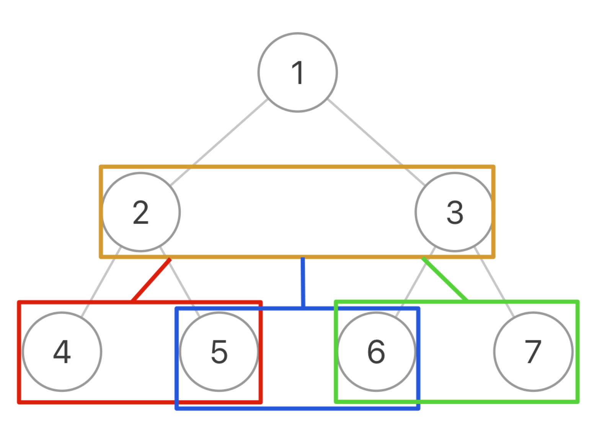

## Populating Next Right Pointers in Each Node

### 遍历的思路



这样，一棵二叉树被抽象成了一棵三叉树，三叉树上的每个节点就是原先二叉树的两个相邻节点。

现在，我们只要实现一个 traverse 函数来遍历这棵三叉树，每个「三叉树节点」需要做的事就是把自己内部的两个二叉树节点穿起来：

```
class Solution:
    def connect(self, root: 'Optional[Node]') -> 'Optional[Node]':
        
        def traverse(node1, node2):
            if not node1 or not node2:
                return

            #/**** 前序位置 ****/
            # 将传入的两个节点穿起来
            node1.next = node2
            
            # 连接相同父节点的两个子节点
            traverse(node1.left, node1.right)
            traverse(node2.left, node2.right)
            # 连接跨越父节点的两个子节点
            traverse(node1.right, node2.left)

        if not root:
            return
        traverse(root.left, root.right)
        return root

```

### 层序遍历

```
from collections import deque
class Solution:
    def connect(self, root: 'Optional[Node]') -> 'Optional[Node]':
        if not root:
            return 
        nodes = deque()
        nodes.append(root)
        while nodes:
            size = len(nodes)
            for i in range(size-1):
                nodes[i].next = nodes[i+1]
            for i in range(size):
                node = nodes.popleft()
                if node.left:
                    nodes.append(node.left)
                    nodes.append(node.right)
        return root
```