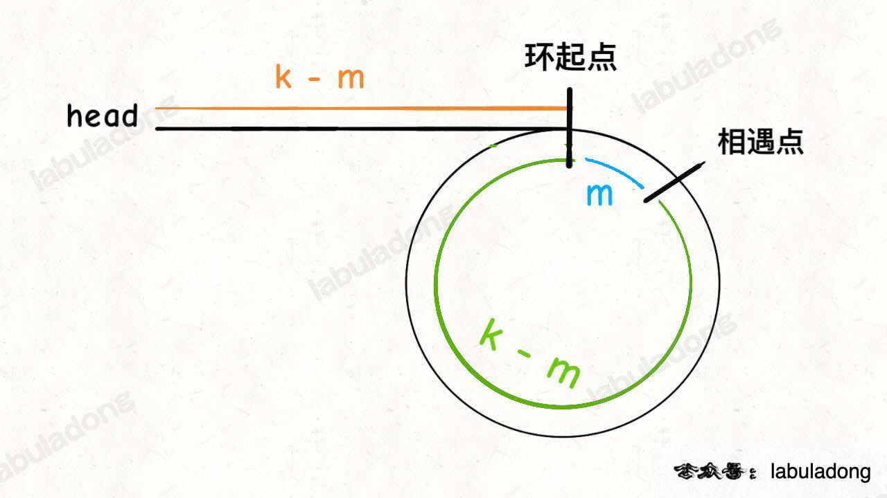

## Linked List Cycle II




```
class Solution:
    def detectCycle(self, head: ListNode) -> ListNode:
        fast = head
        slow = head

        while fast and fast.next:
            slow = slow.next
            fast = fast.next.next
            if slow == fast: break
        
        if not fast or not fast.next:
            return None
        
        fast = head
        
        while fast != slow:
            fast = fast.next
            slow = slow.next
        
        return slow
```