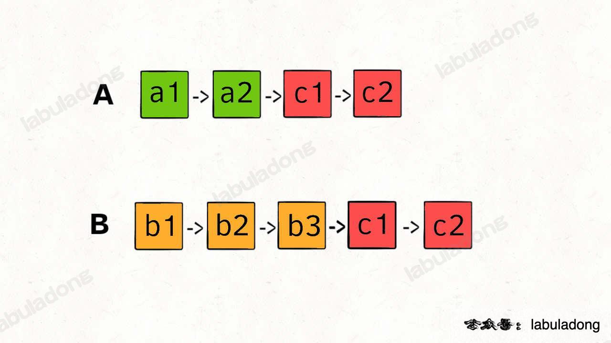

## Intersection of Two Linked Lists

这题难点在于，由于两条链表的长度可能不同，两条链表之间的节点无法对应：

如果用两个指针 p1 和 p2 分别在两条链表上前进，并不能同时走到公共节点，也就无法得到相交节点 c1。

解决这个问题的关键是，通过某些方式，让 p1 和 p2 能够同时到达相交节点 c1。

如果用两个指针 p1 和 p2 分别在两条链表上前进，我们可以让 p1 遍历完链表 A 之后开始遍历链表 B，让 p2 遍历完链表 B 之后开始遍历链表 A，这样相当于「逻辑上」两条链表接在了一起。

如果这样进行拼接，就可以让 p1 和 p2 同时进入公共部分，也就是同时到达相交节点 c1：




```
class Solution:
    def getIntersectionNode(self, headA: ListNode, headB: ListNode) -> ListNode:
        pointerA = headA
        pointerB = headB

        while pointerA != pointerB:
            pointerA = pointerA.next if pointerA else headB
            pointerB = pointerB.next if pointerB else headA
        
        return pointerA
```

### 其他思路
- 如果把两条链表首尾相连，那么「寻找两条链表的交点」的问题转换成了前面讲的「寻找环起点」的问题：但这道题说不让你改变原始链表的结构，所以你把题目输入的链表转化成环形链表求解之后记得还要改回来，否则无法通过。
- 既然「寻找两条链表的交点」的核心在于让 p1 和 p2 两个指针能够同时到达相交节点 c1，那么可以通过预先计算两条链表的长度来做到这一点
