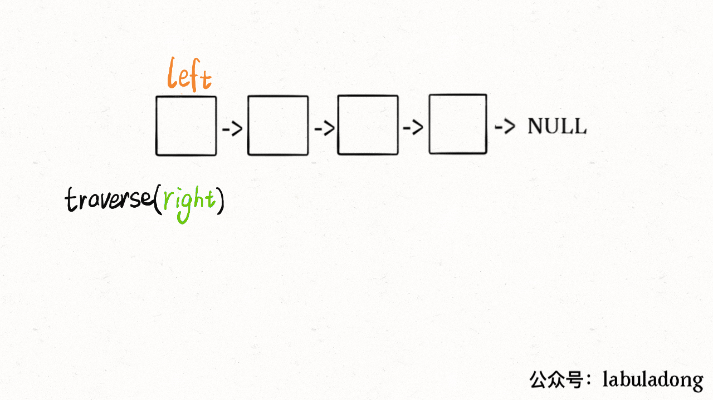
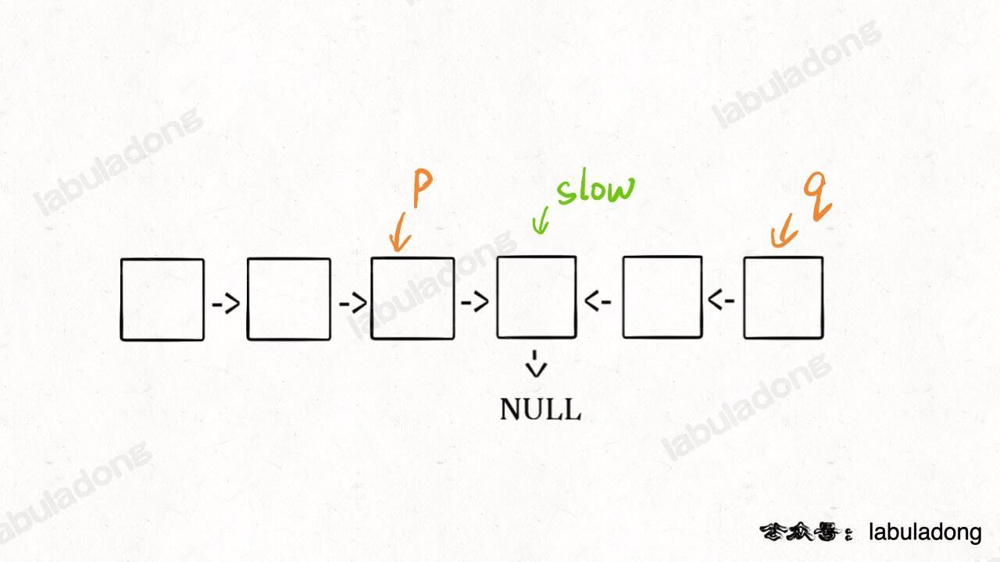

## Palindrome Linked List


### 递归法 O(N) O(N)


```
def isPalindrome(self, head: ListNode) -> bool:
    def traverse(right):
        if not right:
            return True
        result = traverse(right.next)
        result = result and (self.left.val == right.val)
        self.left = self.left.next
        return result
    self.left = head
    return traverse(head)
```


### 双指针迭代法 O(N) O(1)
1. 快慢指针找中点
2. 翻转后面的链表
3. 一一比较
4. 复原



```
def isPalindrome(self, head: ListNode) -> bool:
    slow,fast=head,head
    while fast!=None and fast.next!=None:
        slow=slow.next
        fast=fast.next.next

    pre,cur=None,slow
    while cur!=None:
        nxt= cur.next
        cur.next=pre
        pre=cur
        cur=nxt

    while pre!=None:
        if pre.val!=head.val:
            return False
        pre=pre.next
        head=head.next
    return True
```