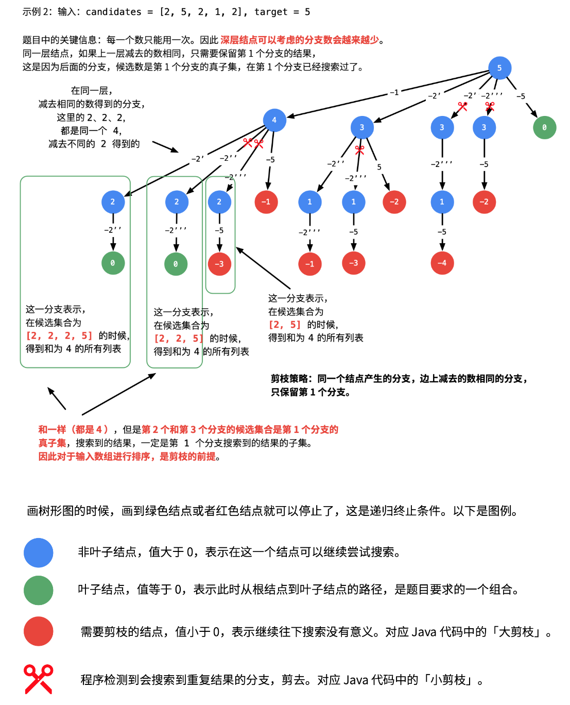

## Combination Sum II


在基础的回溯算法的基础上多了一些东西
- 每一个数字只能用一次，且希望结果里面没有重复的答案。（之前每个数字可以无限用的时候，输入数据里就没必要有重复的数据了）
- 每一个数字只用一次涉及到 回溯的迭代需要index+1
- 去重涉及到了两种方法：
  - 利用哈希表天然的不重复特性
  - 利用第 39 题和第 15 题（三数之和）类似的思路：不重复就需要按 顺序 搜索， 在搜索的过程中检测分支是否会出现重复结果 。注意：这里的顺序不仅仅指数组 candidates 有序，还指按照一定顺序搜索结果。
- 剪枝放for里面 快一点
  



```
class Solution:
    def combinationSum2(self, candidates: List[int], target: int) -> List[List[int]]:

        def backtrack(combination, start):
            if sum(combination) == target:
                combinations.append(combination[:])
                return

            for idx in range(start, len(candidates)):
                if sum(combination) + candidates[idx] > target:
                    break
                if idx > start and candidates[idx] == candidates[idx-1]:
                    continue
                combination.append(candidates[idx])
                # print(combination)
                backtrack(combination, idx+1)
                combination.pop()

        combinations = []
        combination = []
        candidates.sort()
        backtrack(combination, 0)

        return combinations
```