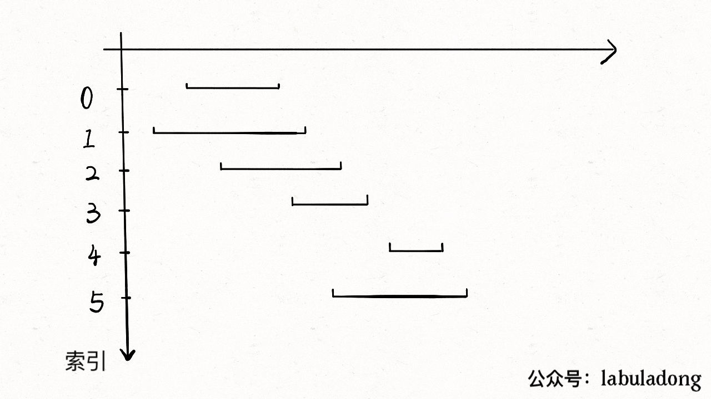

## 435_Non-overlapping Intervals

1、从区间集合 intvs 中选择一个区间 x，这个 x 是在当前所有区间中结束最早的（end 最小）。

2、把所有与 x 区间相交的区间从区间集合 intvs 中删除。

3、重复步骤 1 和 2，直到 intvs 为空为止。之前选出的那些 x 就是最大不相交子集。

把这个思路实现成算法的话，可以按每个区间的 end 数值升序排序，因为这样处理之后实现步骤 1 和步骤 2 都方便很多，如下 GIF 所示：



```
class Solution:
    def eraseOverlapIntervals(self, intervals: List[List[int]]) -> int:
        intervals.sort(key=lambda x:x[1])
        count = 1
        end = intervals[0][1]
        for interval in intervals:
            if interval[0] >= end:
                count += 1
                end = interval[1]
        return len(intervals) - count 

```