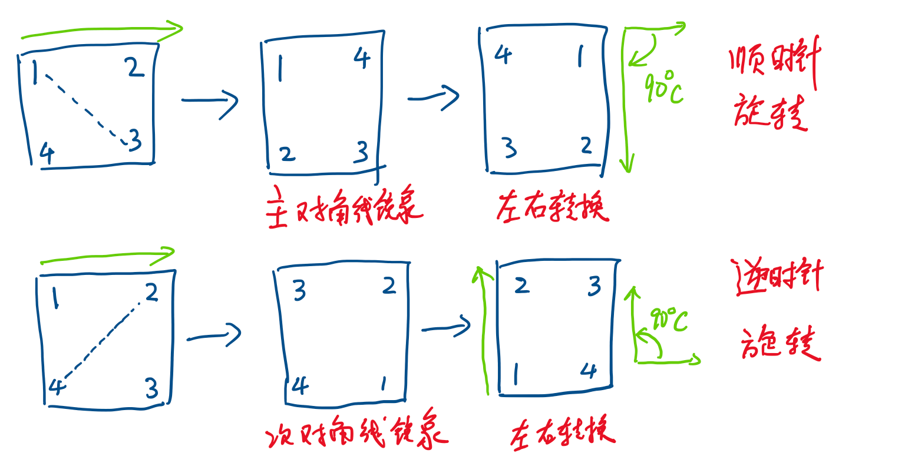

## Rotate Image



```
class Solution:
    def rotate(self, matrix: List[List[int]]) -> None:
        """
        Do not return anything, modify matrix in-place instead.
        """

        m = len(matrix)
        n = len(matrix[0])
        for i in range(m):
            for j in range(i, n):
                temp = matrix[i][j]
                matrix[i][j] = matrix[j][i]
                matrix[j][i] = temp
        
        for row in range(m):
            i = 0
            j = n-1
            while i < j:
                matrix[row][i], matrix[row][j] = matrix[row][j], matrix[row][i]
                i += 1
                j -= 1
            
```