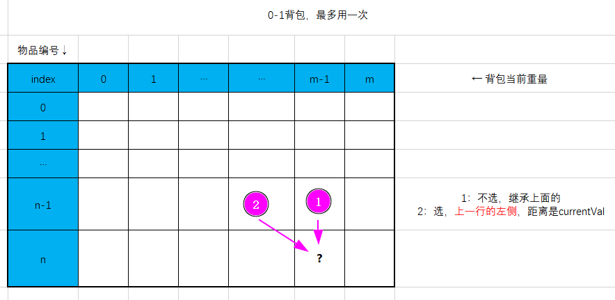
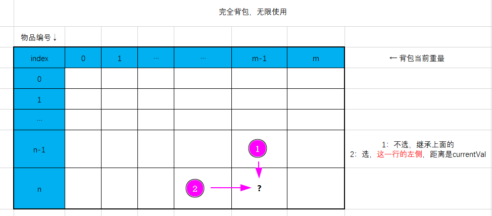

## Coin Change 2

### 回溯 超时了

```
class Solution:
    def change(self, amount: int, coins: List[int]) -> int:
        
        def traverse(path, index):
            if path == amount:
                self.count += 1
                return
            if path > amount:
                return
            
            for i in range(index, n):
                traverse(path + coins[i], i)
        
        coins.sort()
        n = len(coins)
        self.count = 0
        traverse(0, 0)
        return self.count
```


### dp

完全背包：第i件可重复，所以是i的状态转移 dp[i][j] = dp[i-1][j] + dp[i][j-coins[i-1]];  
01背包：第i件物品不能重复，所以是上一个i-1的状态转移 dp[i][j] = dp[i-1][j] + dp[i-1][j-coins[i-1]];



```
class Solution:
    def change(self, amount: int, coins: List[int]) -> int:
        
        n = len(coins)
        dp = [[0] * (amount+1) for _ in range(n+1)]

        for i in range(n+1):
            dp[i][0] = 1

        for i in range(1, n+1):
            for j in range(1, amount+1):
                if j - coins[i-1] >= 0:
                    dp[i][j] = dp[i-1][j] + dp[i][j-coins[i-1]]
                else:
                    dp[i][j] = dp[i-1][j]
        return dp[n][amount]
```
```
class Solution:
    def change(self, amount: int, coins: List[int]) -> int:
        
        n = len(coins)
        dp = [0] * (amount+1) 

        dp[0] = 1

        for i in range(1, n+1):
            for j in range(1, amount+1):
                if j - coins[i-1] >= 0:
                    dp[j] = dp[j] + dp[j-coins[i-1]]

        return dp[amount]
```