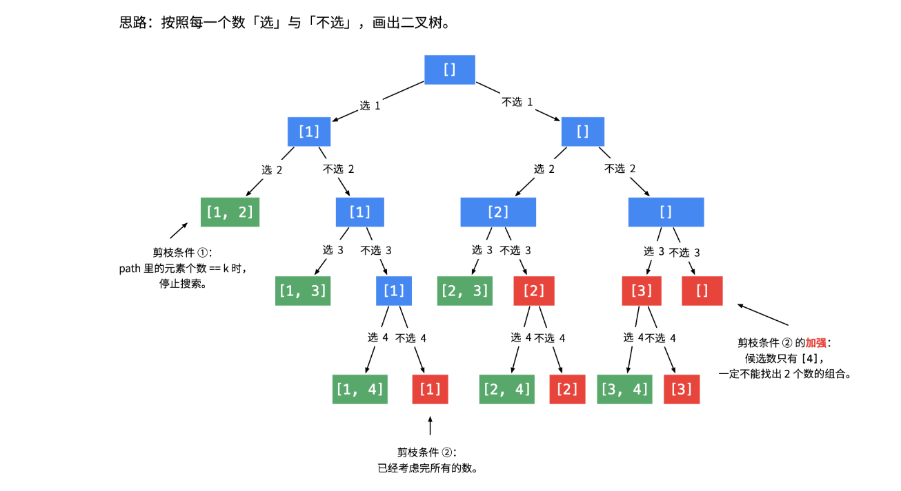

## Combinations

剪枝条件不好找

### 普通标准版
```
class Solution:
    def combine(self, n: int, k: int) -> List[List[int]]:

        def backtrack(nums: List[int], combination: List[int], start: int):
            if len(combination) == k:
                combinations.append(combination)
                return
            
            for idx in range(start, n):
                backtrack(nums, combination+[nums[idx]], idx+1)

        nums = list(range(1, n+1))
        combinations = []
        backtrack(nums, [], 0)
        return combinations
```

### 剪枝方法一：分析搜索起点的上界进行剪枝
归纳法：
- 搜索起点的上界 + 接下来要选择的元素个数 - 1 = n
- 搜索起点的上界 = n - (k - path.size()) + 1
```
class Solution:
    def combine(self, n: int, k: int) -> List[List[int]]:

        def backtrack(nums: List[int], combination: List[int], start: int):
            if len(combination) == k:
                combinations.append(combination)
                return
            if start > n-(k-len(combination))+1:
                return
            for idx in range(start, n):
                backtrack(nums, combination+[nums[idx]], idx+1)

        nums = list(range(1, n+1))
        combinations = []
        backtrack(nums, [], 0)
        return combinations

```

### 剪枝方法二：按照每一个数选与不选画出二叉树

```
class Solution:
    def combine(self, n: int, k: int) -> List[List[int]]:
        def dfs(k, start, path):
            if not k:
                res.append(path)
                return
            # 剪枝
            if start > n - k + 1: return
            # 不选
            dfs(k, start + 1, path)
            # 选
            dfs(k - 1, start + 1, path + [start])
        
        res = []
        dfs(k, 1, [])
        return res
```