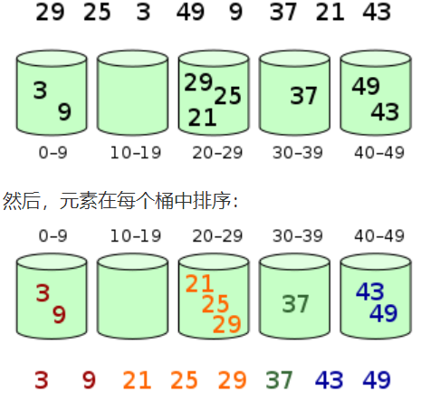

## 解释__init__和__new__
__new__和__init__的主要区别在于：  
__new__是用来创造一个类的实例的（constructor），而__init__是用来初始化一个实例的（initializer）。


## 列表和元组的区别
- 列表是动态数组，它们可变且可以重设长度（改变其内部元素的个数）。
- 元组是静态数组，它们不可变，且其内部数据一旦创建便无法改变。
- 元组缓存于Python运行时环境，这意味着我们每次使用元组时无须访问内核去分配内存。

- 这些区别结实率两者在设计哲学上的不同：

    - 列表可被用于保存多个互相独立对象的数据集合
    - 元组用于描述一个不会改变的事务的多个属性


## 深拷贝和浅拷贝的区别
首先，对赋值操作我们要有以下认识：
- 赋值是将一个对象的地址赋值给一个变量，让变量指向该地址（ 旧瓶装旧酒 ）。
- 修改不可变对象（str、tuple）需要开辟新的空间
- 修改可变对象（list等）不需要开辟新的空间
    - 浅拷贝仅仅复制了容器中元素的地址
      - 浅拷贝是在另一块地址中创建一个新的变量或容器，但是容器内的元素的地址均是源对象的元素的地址的拷贝。也就是说新的容器中指向了旧的元素（ 新瓶装旧酒 ）。
    - 深拷贝，完全拷贝了一个副本，容器内部元素地址都不一样
      - 深拷贝是在另一块地址中创建一个新的变量或容器，同时容器内的元素的地址也是新开辟的，仅仅是值相同而已，是完全的副本。也就是说（ 新瓶装新酒 ）。
  

## 构造函数和析构函数的作用
析构函数于构造函数相对应，构造函数是对象创建的时候自动调用的，而析构函数就是对象在销毁的时候自动调用的的

特点：

1）构造函数可以有多个来构成重载，但析构函数只能有一个，不能构成重载

2）构造函数可以有参数，但析构函数不能有参数

3）与构造函数相同的是，如果我们没有显式的写出析构函数，那么编译器也会自动的给我们加上一个析构函数，什么都不做；如果我们显式的写了析构函数，那么将会覆盖默认的析构函数

4）在主函数中，析构函数的执行在return语句之前，这也说明主函数结束的标志是return，return执行完后主函数也就执行完了，就算return后面还有其他的语句，也不会执行的


## Python列表去除重复元素的做法
方法1：朴素方法
这种方式是在遍历整个list的基础上，将第一个出现的元素添加在新的列表中。
```
res = []
for i in test_list:
    if i not in res:
        res.append(i)
```
方法2：列表解析式
这种方式实际上是第一种方法的简化版，它利用列表解析式，使用一行代码就可以替代上面的循环方式。
```
res = []
[res.append(x) for x in test_list if x not in res]
```
方法3：使用set()
这种方式是最流行的方法来去除列表中的重复元素。但该方法的最大的一个缺点就是使用过后列表中元素的顺序不再继续保持与原来一致了。
```
test_list = list(set(test_list))
```
方法4：利用列表解析式 + enumerate()
该方法是在列表解析式的基础上利用枚举来去除重复元素。通过检查元素是否已经在列表中存在从而将其略过。这种方法可以保持列表中的元素顺序不会改变。
```
res = [i for n, i in enumerate(test_list) if i not in test_list[:n]]
```
方法5：利用collections.OrderedDict.fromkeys()
这是完成特殊任务中最快的方法。它先是将列表中的重复项移除并返回一个字典，最后转换成列表。这种方法对于字符串也可以进行处理。
```
from collections import OrderedDict
res = list(OrderedDict.fromkeys(test_list))
```
方法6：处理嵌套列表中的重复元素
对于多维列表（列表嵌套）中的重复元素去除。这里假设列表中元素（也是列表）它们具有相同的元素（但不一定顺序相同）都被当做重复元素。那么下面使用 set() + sorted() 方法来完成任务。
```
res = list(set(tuple(sorted(sub)) for sub in test_list))
```
方法7：字典（哈希表）


## 解释堆排序和桶排序
堆排序（Heapsort）是指利用堆这种数据结构所设计的一种排序算法。堆积是一个近似完全二叉树的结构，并同时满足堆积的性质：即子结点的键值或索引总是小于（或者大于）它的父节点。堆排序可以说是一种利用堆的概念来排序的选择排序。分为两种方法：

1. 大顶堆：每个节点的值都大于或等于其子节点的值，在堆排序算法中用于升序排列；
2. 小顶堆：每个节点的值都小于或等于其子节点的值，在堆排序算法中用于降序排列；
堆排序的平均时间复杂度为 Ο(nlogn)。

### 算法步骤
1. 创建一个堆 H[0……n-1]；
2. 把堆首（最大值）和堆尾互换；
3. 把堆的尺寸缩小 1，并调用 shift_down(0)，目的是把新的数组顶端数据调整到相应位置；
4. 重复步骤 2，直到堆的尺寸为 1。


桶排序是计数排序的升级版。它利用了函数的映射关系，高效与否的关键就在于这个映射函数的确定。为了使桶排序更加高效，我们需要做到这两点：

在额外空间充足的情况下，尽量增大桶的数量
使用的映射函数能够将输入的 N 个数据均匀的分配到 K 个桶中
同时，对于桶中元素的排序，选择何种比较排序算法对于性能的影响至关重要。

1. 什么时候最快
当输入的数据可以均匀的分配到每一个桶中。

2. 什么时候最慢
当输入的数据被分配到了同一个桶中。

3. 示意图
元素分布在桶中：




## 怎么做括号匹配